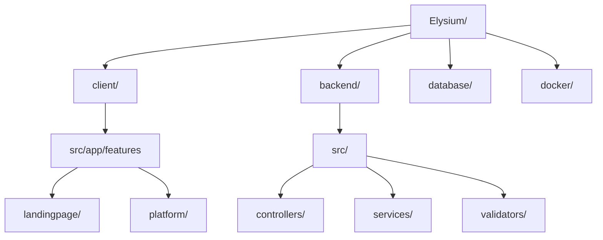

<div align="center">

  

  # 🌌 ELYSIUM
  ### *Elevando la Simbiosis Creativa y la Colaboración Mutua*

  [](https://angular.io/)
  [](https://nodejs.org/)
  [](https://www.postgresql.org/)
  [](https://tailwindcss.com/)

  <p align="center">
    <a href="#-sobre-el-proyecto">Sobre el Proyecto</a> •
    <a href="#-tecnologías">Tecnologías</a> •
    <a href="#-estructura">Estructura</a> •
    <a href="#-empezando">Configuración</a> •
    <a href="#-características">Funcionalidades</a> •
    <a href="#-hoja-de-ruta">Hoja de Ruta</a> •
    <a href="#-contacto">Contacto</a>
  </p>

  
</div>

---

## 📖 Sobre el Proyecto

> [!NOTE]
> *“Donde la creatividad se encuentra con la ayuda mutua.”*
> Elysium es una plataforma de nueva generación diseñada para fomentar la simbiosis entre creadores independientes y profesionales.

[Breve descripción de alto nivel del proyecto aquí. Explica el propósito de la plataforma.]

---

## 🛠 Tecnologías Utilizadas

### **Arquitectura Frontend**
| Tecnología | Uso |
| :--- | :--- |
| **Framework** | Angular 18+ |
| **Estilos** | Tailwind CSS / Vanilla CSS |
| **Animaciones** | GSAP / CSS Transitions |
| **Estado** | Signals / RxJS |

### **Ecosistema Backend**
| Tecnología | Uso |
| :--- | :--- |
| **Entorno** | Node.js |
| **Framework** | Express.js |
| **Base de Datos** | PostgreSQL / SQL |
| **Seguridad** | Bcrypt / JWT / CORS |

---

## 📂 Estructura del Proyecto



---

## 🚀 Empezando

### **Prerrequisitos**
- Node.js (v18+)
- PostgreSQL
- Gestor de paquetes (pnpm/npm)

### **Instalación**

1. **Clonar el repositorio**
   ```bash
   git clone https://github.com/usuario/elysium.git
   cd elysium
   ```

2. **Configuración del Frontend**
   ```bash
   cd client
   pnpm install
   ng serve
   ```

3. **Configuración del Backend**
   ```bash
   cd ../backend
   pnpm install
   # Configura tu archivo .env
   pnpm dev
   ```

---

## ✨ Características Principales

- [ ] **Autenticación Dual:** Registro e inicio de sesión seguro para usuarios y empresas.
- [ ] **Lógica de Ayuda Mutua:** Sistema dinámico de recompensas y colaboración.
- [ ] **Landing Interactiva:** Visuales de alto rendimiento y animaciones fluidas.
- [ ] **Encriptación Extremo a Extremo:** Comunicaciones privadas y seguras.

---

## 🗺 Hoja de Ruta (Roadmap)

- [x] Arquitectura Inicial y Esquema DB
- [x] UI de la Landing Responsiva
- [ ] Implementación del Panel de Usuario
- [ ] Herramientas de Colaboración en Tiempo Real
- [ ] Versión para Aplicación Móvil

---

## 🤝 Contribuir

Las contribuciones son las que hacen que la comunidad de código abierto sea un lugar increíble para aprender, inspirar y crear.

1. Haz un Fork del proyecto
2. Crea tu rama de función (`git checkout -b feature/NuevaFuncionalidad`)
3. Haz commit de tus cambios (`git commit -m 'Añadir NuevaFuncionalidad'`)
4. Haz push a la rama (`git push origin feature/NuevaFuncionalidad`)
5. Abre un Pull Request

---

## 📧 Contacto

**Desarrollador Principal:** Tu Nombre - [LinkedIn](https://linkedin.com/in/tuperfil) - email@ejemplo.com

Enlace del Proyecto: [https://github.com/usuario/elysium](https://github.com/usuario/elysium)

<div align="center">
  <sub>Construido con ❤️ para la Comunidad Creativa</sub>
</div>
