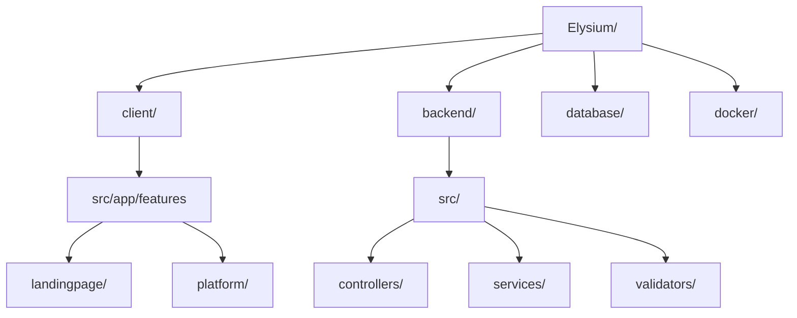

<div align="center">

  

  # ELYSIUM
  ### *Elevando la Simbiosis Creativa y la Colaboración Mutua*

[](https://angular.io/) [](https://nodejs.org/) [](https://mariadb.org/)  [](https://www.docker.com/)  [](https://tailwindcss.com/)
 
  
  <p align="center">
    <a href="#-sobre-el-proyecto">Sobre el Proyecto</a> •
    <a href="#-tecnologías">Tecnologías</a> •
    <a href="#-estructura">Estructura</a> •
    <a href="#-empezando">Configuración</a> •
    <a href="#-características">Funcionalidades</a> •
    <a href="#-hoja-de-ruta">Hoja de Ruta</a> •
    <a href="#-contacto">Contacto</a>
  </p>

  
</div>

---

## 📖 Sobre el Proyecto

> [!NOTE]
> *“La ayuda que necesitaban los modelos”*
> Elysium es una plataforma orientada a ser una red social pero que su enfoque es más laboral que de ocio. 

---

## 🛠 Tecnologías Utilizadas

### **Arquitectura Frontend**          
| Tecnología | Uso |
| :--- | :--- |
| **Framework** | Angular |
| **Estilos** | Tailwind CSS / Vanilla CSS |
| **Animaciones** | GSAP / CSS Transitions |

### **Ecosistema Backend**
| Tecnología | Uso |
| :--- | :--- |
| **Entorno** | Node.js |
| **Framework** | Express.js |
| **Base de Datos** | MariaDB / SQL |
| **Seguridad** | Bcrypt / JWT / CORS |

---

## 📂 Estructura del Proyecto



---

## 🚀 Empezando

### **Prerrequisitos**
 1. Tener docker instalado. 
 2. Tener node instalado (Implementar npm y pnpm ). 
 3. Angular instalado. 
 4. Pedirme las credenciales de los ENV (backend y frontend). 


### **Instalación**

1. **Clonar el repositorio**
   ```bash
   git clone https://github.com/Josehaap/Elysium
   cd elysium
   ```
2. Confiruación de la base de datos. 
    ```bash
   cd docker
   docker compose up
   
   ```
   En este preciso instante se debería de generar en docker desktop un contenedor de la imagen de mariadb. 

2. **Configuración del Frontend**
   ```bash
   cd ../client
   pnpm install
   ng serve
   ```

3. **Configuración del Backend**
   ```bash
   cd ../backend
   pnpm install
   # Configura tu archivo .env ejemplo en env.example
   pnpm dev
   ```

---


